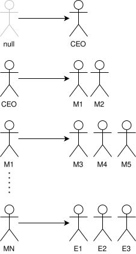
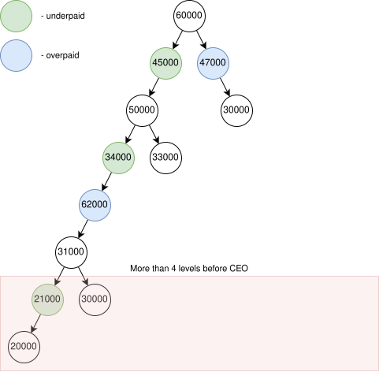

# Organizational Structure Analyzer

## 📜 How it works

1. First, we need to parse the CSV file into a hierarchical structure (using `Map`), where the key is the manager and
   the
   value is a `Set` of subordinates.

> [!NOTE]  
> The CEO employee will always have a `null` as the key.



2. Next, we traverse the hierarchy as a tree, with the CEO as the root, using
   a [DFS algorithm](https://en.wikipedia.org/wiki/Depth-first_search). Each employee is treated as a node in the tree,
   with their salary as the node's value. During this traversal, we need to identify and report two key issues:
    1. **Salary Issue**: If a manager is underpaid or overpaid compared to their subordinates.
    2. **Management Level Issue**: If an employee has more than 4 managers between them and the CEO.

   To determine the **Salary Issue**:
    1. Calculate the average salary of direct subordinates (`avgSalary`).
    2. Set the minimum and maximum manager salary as `avgSalary * 1.2` and `avgSalary * 1.5`, respectively.
    3. If the manager's salary is outside this range, mark it as underpaid or overpaid and calculate the difference.

   To determine the **Management Level Issue**, we simply check if the node's depth minus one exceeds 4.



## 🛠️ Installation

### Requirements

- **Java SE 21** (or higher)
- **Maven 3.6.3** (or higher)

### Run

1. Clone the repository:
   ```bash
   git clone https://github.com/alkondrey/org-structure-analyzer.git
   ```

2. Navigate to the project directory:
   ```bash
   cd org-structure-analyzer
   ```

3. Build the package using Maven:
    ```bash
    mvn clean package
    ```

4. Run the application:
   ```bash
   java -jar target/*.jar <path-to-employees-csv>
   # Or
   java -jar target/*.jar src/test/resources/cases/process-general-case/input.csv
   ```

### CSV File Constraints

1. The first row **must contain** the following headers (case-sensitive):
   `Id,firstName,lastName,salary,managerId`
2. The file must include **at least one** CEO (an employee without a `managerId`).

[Example](./src/test/resources/cases/process-general-case/input.csv)

## 💡 Assumptions

- **Managers are employees**: We calculate the reporting line length and determine if it exceeds the allowed limit.
- **The CEO is also a manager**: We calculate if the CEO's salary is underpaid or overpaid compared to the salaries of
  their direct subordinates.
- For the pilot release, inconsistent data will cause affected employees to be ignored instead of throwing errors:
    - Circular manager relationships
    - Non-existent `managerId`
    - Multiple CEOs
    - Duplicate IDs
